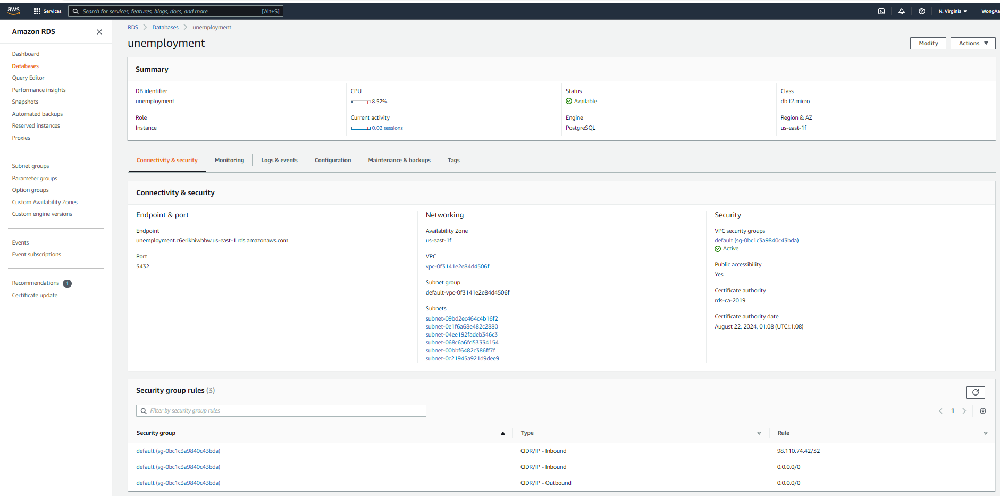
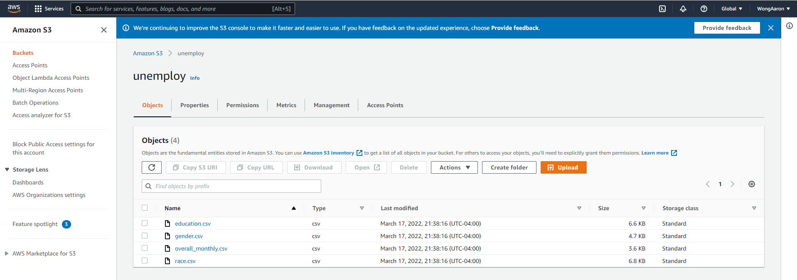
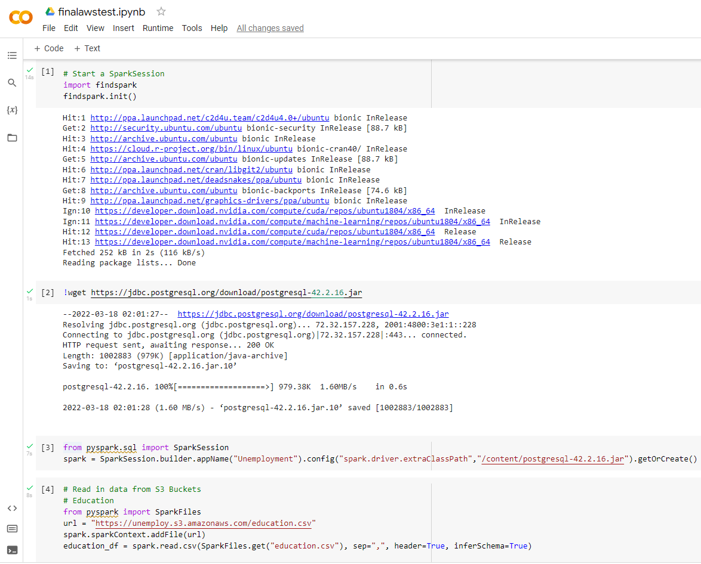
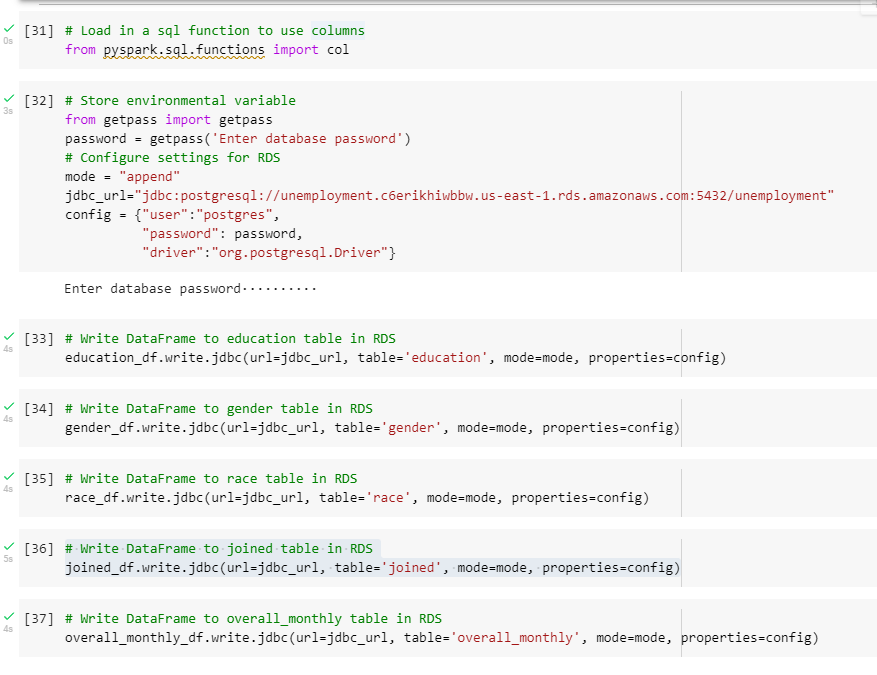
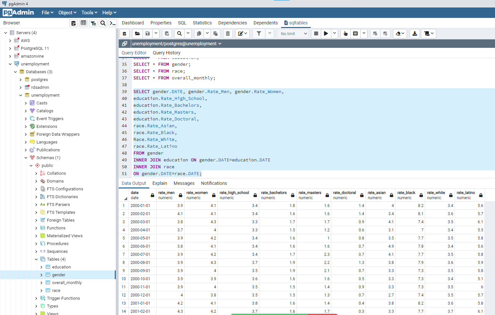
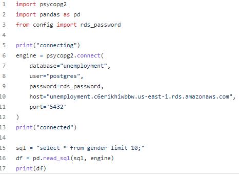
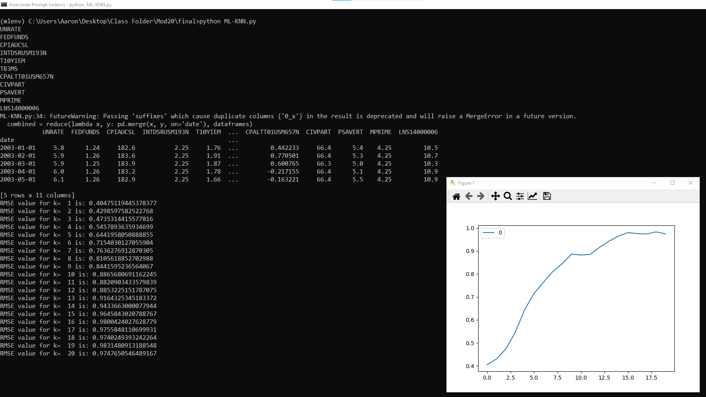
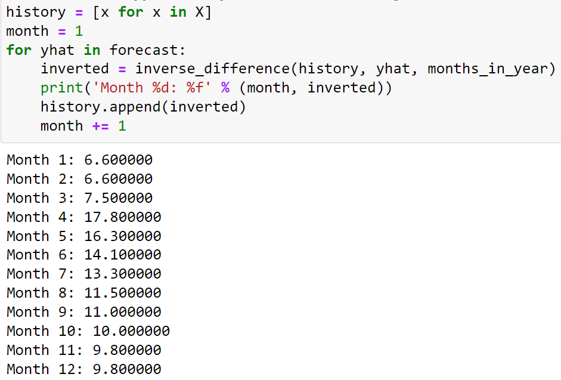

# US Unemployment Analysis

## Introduction
####
Our team decided to analyze US unemployment data and focus on the data from the years 2000 - 2021. 

## Why was this topic selected? 
####
We selected this topic because we are interested in the impact that major events can have on the unemployment rate fluctuation. We would like to put our data science skills to the test in order to see how the different variables influence the rate.

## Technologies In Use
####
In this project we will be using the following: 
* PostgreSQL 
* Pandas 
* VSCode 
* Jupyter Notebook 
* JavaScript
* CSS
* HTML
* PGAdmin 
* MongoDB 
* Python 
* AWS 
* Google Colab
* PySpark 
* Machine Learning

## Our Roadmap
### Data Exploration and Analysis
####
We collected data sets from the Bureau of Labor Statistics website (BLS) [https://www.bls.gov/data/], a national organization that provides data on labor market activity, working conditions, price changes, and productivity in the US economy. Additionally, we examined datasets from The Federal Reserve Bank of St. Louis' Federal Reserve Economic Database (FRED) [https://fred.stlouisfed.org/], which is one of the nation's leading trusted sources for economic data. The CSV files we retrieved contain 20+ years (2000-2021) of information which we feel is a sufficient historical view that can be leveraged in order to predict a future outcome. Some of the data columns that we are reviewing include data on educational levels, race, and gender. 

For the data exploration phase, we used an API key to scrape data from the St. Louis FRED website. We selected a few reports that are related to the US unemployment rate and mapped it into a DataFrame using the reduce() method, then saved the results into a CSV file. We filtered and cleaned the data with Python to get rid of duplicate or null rows/columns of data, as then combined related categories into a single CSV (i.e. separate CSV datasets for Male and Female data combined into one CSV [gender.csv]). 

Next, once all the CSVs were sorted and cleaned to only include relevant data, we created an AWS RDS cloud database and linked it to Postgres/pgAdmin4 using a connection string.

In AWS, an S3 bucket was created where the cleaned CSVs were uploaded to house our data in the cloud.

We were able to access/read these CSVs from Google Colab/PySpark. 

From pgAdmin4, SQL queries were written and executed to create the necessary tables to store the data in Postgres/pgAdmin4. A table was created for each compiled CSV and their respective CSV was imported/written into each table via Google Colab/PySpark.

We also wrote a query to join multiple tables, strictly using the database language.

Though the datasets are housed in the cloud and linked to the database, the database was initially created by one member on their local machine. However, the other members of the group are easily able to access the database and contents by executing the following code:

## Machine Learning Models
####
The analysis phase of this project is implemented through our machine learning models. Our data is primarily continuous rather than categorical. Therefore, we will not be predicting a binary outcome, but rather a numerical outcome. The prediction we are trying to make is what the unemployment rate will be at the end of December 2022 or even in the next month.

### K-Neareast Neighbor (KNN)
One of the machine learning models we will be implementing is the K-Nearest Neighbor (KNN) algorithm. KNN can be used for either linear regression or classification. For our analysis, we intend to use additional data (job openings for various industries and consumer prices for meats) that were pulled from the API call and split them into training and testing sets. The data on job openings and meat prices will be used as the features (X) and the unemployment rate will be used as the target (Y). To confirm that this model is accurate and a good fit, we decided it will be best to use only 1 year's worth of data (Year 2001) and try to predict the next year's worth of data (Year 2002). A graph will then be generated to visualize the results. Before this though, we practiced by using the API to pull other sorts of data to see if it would work. Please refer to the [ML-KNN.py](ML-KNN.py) file for reference. The code seemed to run successfully, and a graph was generated. See below for the results. We intend to revamp the code to run for the aforementioned releveant datasets next.

### Support Vector Regression (SVR)

### AutoRegressive Integrated Moving Average (ARIMA)
We are also exploring the AutoRegressive Integrated Moving Average (ARIMA) machine learning model, a type of time series forecasting model. Forecasting is a popular ML method to use when predicting the future values the series is going to take. Depending on the frequency, a time series can be of yearly (ex: annual budget), quarterly (ex: expenses), monthly (ex: air traffic), weekly (ex: sales qty), daily (ex: weather), hourly (ex: stocks price), minutes (ex: inbound calls in a call center) and even seconds wise (ex: web traffic). This fits our analysis since unemployment rate data is typically released monthly/yearly and our intention is to predict possible values for the unemployment rate at either the end of the year in December 2022 or even at the end of next month. We plan to use a Time Series model to quantify future unemployment rates using singular dataset CSVs each time to predict what the US national unemployment rate will be in general, as well as for each of the different variables, by December 2022.

The mathematical processes behind how the ARIMA test works is a bit complicated and the model itself has multiple variations, though they all work from the same fundamentals. ARIMA works best on datasets that have stationarity (no trends). There is a method known as "differencing" that can be used to make a dataset stationary if it isn't, but luckily our datasets were confirmed to already be stationary by running a few handy lines of Python code. Without going into full detail of how the ARIMA model works, one of the most critical components to take note of is the best order of the ARIMA model to use, which is based on the lowest Akaike Information Criterion (AIC) score. The order is a combination of 3 number values in the format of (p,d,q), where p refers to the number of lag observations in the model, d referring to the number of times that raw observations are differenced, and q referring to the size of the moving average window. A handy built-in python package and a few lines of template code were used to help us determine this order for our model, which turned out to be (0,1,0). 

We attempted the ARIMA test in multiple ways, however, no single variation was able to provide us a reliable result. All attempted variations had their own distinct issues along the way that we could not find solutions for in the given time, though we’re sure they exist. All 3 variations were conducted using the overall national Unemployment Rate dataset from 2000-2021 (overall_monthly.csv). We intended to first find the predicted national rate for all twelve months in 2022. If successful, then we intended to re-apply the same test to the rest of the different categories. However, since we ran into issues even with the first dataset, we concluded that the same issues would persist regardless if any other different categorical dataset were used.

For instance, in the first version of the test we ran, we copied and reformatted some template code used from a previous test example that was originally meant and used for temperature forecasting that predicted temperatures for the next 7 days. We managed to adjust the code enough for it to make predictions on unemployment rate for the next 12 months. However, the resulting numbers were suspiciously way too high (between 6.6 - 17.8). We concluded that there may be some part of the code that we don’t fully understand and did not adjust accordingly enough. Therefore, this variation did not prove to be considered reliable. Please see Arima_Test_1.ipynb for additional reference.

In a 2nd variation attempt at the ARIMA test, we once again followed a template that was originally used for temperature prediction, but from a different code source. We generated a P-value that was less than 0.05, which is ideal. The 'best order model' combination that was generated was once again (0,1,0). This variation seemed to work well up until making predictions after training the model. We followed the suggested model combination but the predictions on the test set resulted in an unchanging/fixed unemployment rate prediction number (6.7). The predicted test set mean unemployment rate was 5.358 and the Root Mean Square Error (rmse) was 1.56, which appears to also be ideal. The code used to produce the resulting predictions for the next months was also problematic because it would only produce at least 30 prediction results. No amount of code tweaking was successful and we could not figure out how to adjust the code to only produce the next 12 results (probably because the original usage was meant for daily temperature predictions). This would be futile anyways though, because the results were also a fixed number (3.9). We suspect that this is occurring due to the fixed nature of the rate prediction from the previous step. Though 3.9 seems to be a reasonable rate number for unemployment, we know this is not reliable because it is fixed for every month. A successful model would have produced fluctuating numbers. Please refer to Arima_Test_2.ipynb for additional reference.

In the 3rd variation attempt at the ARIMA test, we used another template from a different source, although this time the original template was used in a previous example for monthly shampoo sales prediction. This test proved to be the most relevant though because it produced monthly results as opposed to the previous 2 variations that were used to predict daily results. Once again, this variation started off to be a very promising model. Prior to the final number predictions, code was executed and graphs were produced to ensure that the data was stationary and there were no issues with residuals. We were also to reformat the template code to produce a plot that showed the predicted values against the expected/actual values. The plot showed a very promising result indicating that the model was strong. However, this plot only showed predictions that validated the existing dataset. There was no additional template code to run to produce future number predictions. Thus, this is where our fortunes ended, as unlike with the previous two variations, we were unable to figure out how to add code to produce future predictions. Attempts to borrow and reformat code from the first two variations were not successful. Please refer to Arima_Test_3.ipynb for additional reference.

To conclude, between KNN, SVR, and ARIMA, the KNN model proved to be the most "reliable" but we suspect that it could be overfitting the data. We believe that the ARIMA model should be the most reliable model for this project because the nature of what the model is intended for basically aligns with what our project sought to answer. And we believe that if we were able to figure out how to successfully amend the code in each of the three ARIMA variations we tried, then all three versions could have potentially provided us with very reasonable results and therefore prove to be the most reliable model amongst the three different models.

### Dashboard
####
To fully visualize the results of our analysis, we used JavaScript and its d3 library along with HTML and CSS to create an interactive web page that houses all the resulting graphs. Our interactive dashboard allows the user the ability to click on a collapsible tab to see the steps taken by the team to produce the results from our exploration. Our website can be accessed by running the [index2.html](index2.html) through a Live Server, which works in conjunction with our supporting files contained in subfolders [here](static). See below for a snippet of our webpage.

